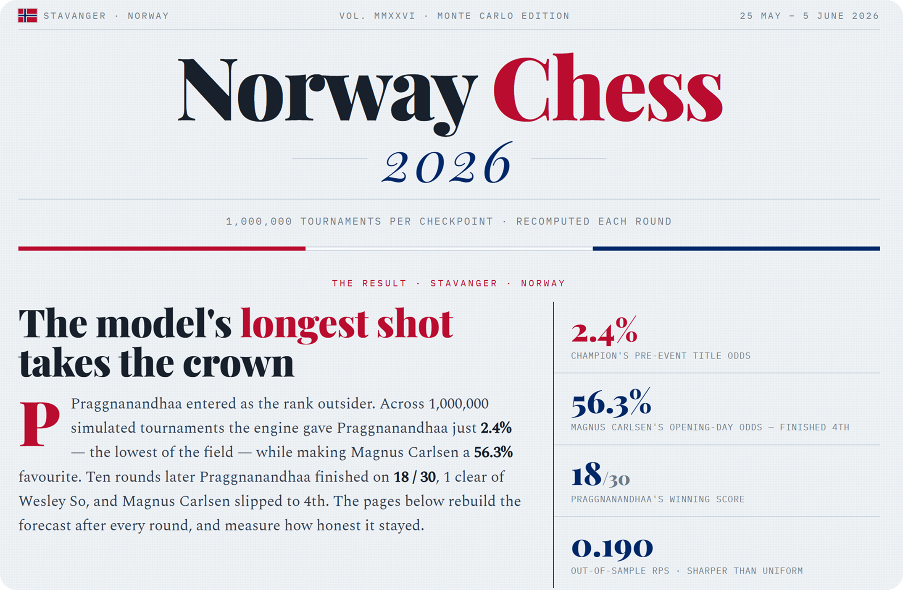

# Norway Chess 2026 — Monte Carlo Simulation
<p align="center">
  
</p>

A reproducible C++/Python Monte Carlo forecasting system for **Norway Chess 2026**.
The model handles Norway Chess’s classical-plus-Armageddon scoring format, runs **1,000,000 simulated tournaments per checkpoint**, re-forecasts after every round, and evaluates its own predictions using proper scoring rules.

The 2026 edition became a stress test for the model: its lowest-rated title candidate by pre-tournament probability, **Praggnanandhaa at 2.4%**, won the event, while its **56.3% favorite, Magnus Carlsen**, finished 4th. The result produced a near-total inversion of the model’s expected ranking and makes the project useful not only as a forecasting engine, but also as a post-mortem on calibration, draw modelling, and in-event form updates.

A classical win scores `3 / 0`. A classical **draw** is resolved by an **Armageddon** tiebreak, where White must win and Black only needs a draw. A drawn classical game followed by Armageddon scores `1.5 / 1`. Every game therefore has four modelled outcomes:

```text
classical win / Armageddon win / Armageddon loss / classical loss
```
## Dashboard

**Project page:** https://musalimov.github.io/chess_monte_carlo/norway2026_dashboard.html

A self-contained browser dashboard generated by `tools/viz/generate_html.py`.
It is a single static HTML file: no backend, no database, and no server-side dependencies.

Features:

* **Title-probability timeline** across all rounds, based on **1,000,000 Monte Carlo simulations per checkpoint**
* **Player toggle chips** and Armageddon-model switching for comparing forecast variants
* **Round-by-round standings table** with score, title probability, expected points, and maximum reachable score
* **Title-race view** showing current points, maximum reachable points, and eliminated players
* **Match prediction cards** for every round, showing four-way probabilities: classical win, Armageddon win/loss, and classical loss
* **Actual result highlighting** to compare the model’s forecast with what happened on the board
* **Calibration section** with reliability curve and per-round Brier score chart
* **Final-place distribution heatmap** with the actual finishing position outlined
* **Player appendix** with Classical, Rapid, Blitz ratings, style multipliers, and final ranks
* **Model appendix** explaining draw probability, Armageddon assumptions, form updates, and calibrated parameters
* **Norway-inspired light theme** with responsive static SVG charts

The dashboard is the final inspection layer for the simulation engine, calibration pipeline, generated JSON outputs, and historical Norway Chess data.

## Table of contents

* [Dashboard](#dashboard)
* [What it does](#what-it-does)
* [2026 Norway Chess: result vs forecast](#2026-norway-chess-result-vs-forecast)
  * [The one-line story](#the-one-line-story)
  * [Forecast vs reality](#forecast-vs-reality)
  * [How the title race moved](#how-the-title-race-moved)
  * [Model performance](#model-performance)
  * [What the model got right and wrong](#what-the-model-got-right-and-wrong)
  * [Round-by-round commentary](#round-by-round-commentary)
* [How it works](#how-it-works)
* [Build and run](#build-and-run)
* [Methodology and parameters](#methodology-and-parameters)
* [Repository layout](#repository-layout)
* [Generated outputs](#generated-outputs)
* [Validation](#validation)
* [Acknowledgements](#acknowledgements)

## What it does

The model treats the final standings as a probability distribution rather than a single prediction. It simulates the remaining tournament many times, aggregates the results, and reports how likely each player is to win, where they are expected to finish, and how the title race changes after each round.

Core outputs:

1. **Pre-tournament forecast**
   Runs **1,000,000** simulated tournaments from the starting position and reports title probability, expected final score, and full finishing-place distribution.

2. **Live re-forecasting**
   Conditions on games already played and simulates only the remaining games, producing a round-by-round title-probability trajectory.

3. **Per-game prediction**
   Emits four-way probabilities for every game:
   `P1 classical win / P1 wins Armageddon / P2 wins Armageddon / P2 classical win`.

4. **Armageddon sensitivity**
   Compares four Armageddon strength assumptions: `classical`, `rapid`, `blitz`, and `rapidblitz`.

5. **Self-grading**
   Scores predictions using Brier score, Ranked Probability Score, reliability bins, modal-outcome hit rate, and directional accuracy.

6. **Static dashboard generation**
   Bundles simulation results, calibration outputs, player data, and charts into one self-contained HTML page.

## 2026 Norway Chess: result vs forecast

Six players. Ten rounds. Stavanger, **25 May – 5 June 2026**.
The model was calibrated, sharper than a uniform baseline, and useful at tracking changing title odds — but the actual champion came from the far tail of its pre-tournament distribution.

### The one-line story

> **The model’s least likely champion won the tournament.**
> Praggnanandhaa started with a **2.4%** title probability, ranked last of six by the model, and finished first. Carlsen started as the **56.3%** favorite and finished fourth.

### Forecast vs reality

Pre-tournament probabilities come from one million simulations at `after_round = 0`.
`Δ` is actual points minus expected points: positive means the player beat the model’s projection.

| Player             |  Elo | Model win prob. | Exp. pts | Actual pts |        Δ | Finish |
| ------------------ | ---: | --------------: | -------: | ---------: | -------: | -----: |
| **Praggnanandhaa** | 2733 |  **2.4%** (6th) |     11.0 |   **18.0** | **+7.0** | 🥇 1st |
| So                 | 2754 |      6.9% (5th) |     13.3 |       17.0 | **+3.7** | 🥈 2nd |
| Firouzja           | 2759 |      7.4% (4th) |     12.4 |       15.5 | **+3.1** | 🥉 3rd |
| **Carlsen**        | 2840 | **56.3%** (1st) |     17.7 |       13.0 | **−4.7** |    4th |
| Keymer             | 2765 |     16.6% (2nd) |     14.3 |       11.0 |     −3.3 |    5th |
| Gukesh             | 2734 |     10.4% (3rd) |     12.0 |        8.0 |     −4.0 |    6th |

The model’s projected top half — **Carlsen, Keymer, Gukesh** — finished in the bottom half.
Its projected bottom half — **Firouzja, So, Praggnanandhaa** — finished in the top half.

In rank terms, the forecast was almost perfectly inverted.

### How the title race moved

Win probability after each round:

| After | Carlsen | Keymer | Firouzja |       So | Gukesh |    Pragg |
| ----- | ------: | -----: | -------: | -------: | -----: | -------: |
| Start |    56.3 |   16.6 |      7.4 |      6.9 |   10.4 |      2.4 |
| R1    |    32.4 |   14.7 |     28.3 |      6.8 |   13.7 |      4.1 |
| R2    |    21.7 |   12.8 |     50.8 |      3.5 |   10.4 |      0.7 |
| R3    |     7.0 |   11.6 |     61.4 |      6.0 |    8.3 |      5.7 |
| R4    |    17.4 |    6.8 |     60.1 |      5.4 |    3.0 |      7.4 |
| R5    |     2.8 |    3.2 |     57.9 |     27.5 |    7.9 |      0.7 |
| R6    |     5.1 |    5.0 |     24.0 |     64.0 |    2.0 |       ~0 |
| R7    |     8.8 |    4.4 |      8.1 | **76.6** |    1.5 |      0.5 |
| R8    |      ~0 |    0.6 |     16.4 |     75.2 |     ~0 |      7.8 |
| R9    |      ~0 |     ~0 |      4.9 |     77.5 |     ~0 | **17.6** |
| Final |       — |      — |        — |        — |      — |  **100** |

Three different players became the model’s title favorite at different stages:

```text
Carlsen → Firouzja → So → Praggnanandhaa
```

Carlsen led only before the tournament. Firouzja became the early favorite after his fast start. So took control in the middle rounds and reached **77.5%** with one round left. Praggnanandhaa still had only **17.6%** after Round 9, then won the tournament outright in the final round.

### Model performance

Across **30** games, the model beat the uniform baseline on four-way game prediction, but missed the tournament winner by almost the maximum possible amount.

| Metric                                 |           Value | Baseline / note                  |
| -------------------------------------- | --------------: | -------------------------------- |
| Mean Brier, per game, four-way         |      **0.7273** | 0.75 uniform baseline            |
| Out-of-sample RPS, 2026                |      **0.1902** | from `calibrate.py`              |
| Best-calibrated round                  |   **R4: 0.541** | lowest Brier                     |
| Worst round                            |   **R1: 0.879** | opening-round surprises          |
| Modal-outcome hit rate                 | **18/30 = 60%** | most likely of four outcomes     |
| Directional accuracy on decisive games |  **7/15 = 47%** | winner favored in decisive games |

The model was not useless: it was sharper than a flat 25% four-way guess and produced reasonable probability movement once leaders emerged. But the champion’s path came from a sequence of low-probability decisive wins that the model consistently underweighted.

### What the model got right and wrong

**Good calls**

* **Better than uniform.** Mean Brier was **0.7273**, compared with **0.75** for a uniform four-way guess.
* **Reasonable calibration.** Observed frequencies broadly tracked predicted bins: `11.2% → 17.4%`, `28.5% → 24.1%`, `47.1% → 45.0%`.
* **Title-race tracking.** Firouzja’s early surge, So’s mid-event dominance, and Praggnanandhaa’s late climb all appeared in the title-probability trajectory.
* **Armageddon robustness.** The broad headline barely changed across Armageddon rating assumptions.

**Poor calls**

* **Champion under-rated throughout.** Praggnanandhaa’s decisive wins repeatedly came from extremely low model probabilities:

  * **2%** vs Carlsen in Round 3
  * **1%** vs Carlsen in Round 8
  * **8%** vs Keymer in Round 10
* **Draw model over-fired.** A draw was the single most likely call in **21/30 games**, while only **15/30** games were drawn.
* **Form update reacted too slowly.** `form_k` helped, but not enough to adjust quickly to Carlsen’s underperformance or Praggnanandhaa’s late surge.
* **Directional accuracy was weak in decisive games.** On games that produced a classical win, the model favored the eventual winner only **7/15** times.

**Takeaway:** the model was calibrated on average, but too conservative in decisive games and too slow to react to extreme in-event form. A **2.4%** outcome is not impossible — and Norway Chess 2026 landed in that tail.

## Round-by-round commentary

Full game log with predictions and outcomes.
`✓` means the model’s most likely result class matched the outcome.
`✗` means it did not. Probabilities are shown as `P[win] / P[draw] / P[win]` under the `rapidblitz` Armageddon variant.

<details>
<summary><b>Round 1</b> — opening surprises, worst round by Brier score</summary>

* ✗ **Firouzja 1–0 Carlsen** · `0.08 / 0.67 / 0.25` — the top seed lost with White to a heavy model underdog.
* ✗ **Keymer–Gukesh → Armageddon, Gukesh won** · `0.36 / 0.42 / 0.22` — draw occurred, but the model leaned Keymer in the tiebreak.
* ✓ **So–Pragg → Armageddon, Pragg won** · `0.12 / 0.84 / 0.05` — draw correctly predicted; Pragg took the Armageddon.

</details>

<details>
<summary><b>Round 2</b> — Firouzja announces himself</summary>

* ✗ **Firouzja 1–0 Pragg** · `0.17 / 0.71 / 0.12` — second straight win lifted Firouzja to **50.8%** by Round 2.
* ✓ **Carlsen–Keymer → Armageddon, Carlsen won** · `0.32 / 0.63 / 0.05` — draw correctly predicted.
* ✓ **Gukesh–So → Armageddon, So won** · `0.17 / 0.56 / 0.26` — draw correctly predicted; So won the tiebreak.

</details>

<details>
<summary><b>Round 3</b> — Praggnanandhaa shocks Carlsen</summary>

* ✗ **Pragg 1–0 Carlsen** · `0.02 / 0.65 / 0.32` — the model gave Pragg only **2%** to win outright.
* ✓ **Keymer–So → Armageddon, So won** · `0.17 / 0.82 / 0.01` — draw correctly predicted.
* ✗ **Gukesh–Firouzja → Armageddon, Firouzja won** · `0.30 / 0.45 / 0.26` — Firouzja became the clear model favorite at **61.4%**.

</details>

<details>
<summary><b>Round 4</b> — cleanest round</summary>

* ✓ **Gukesh 0–1 Carlsen** · `0.17 / 0.43 / 0.40` — decisive game leaned correctly.
* ✓ **Keymer–Pragg → Armageddon, Pragg won** · `0.29 / 0.65 / 0.05` — draw correctly predicted.
* ✓ **So–Firouzja → Armageddon, So won** · `0.15 / 0.83 / 0.02` — draw correctly predicted.

</details>

<details>
<summary><b>Round 5</b> — So wakes up</summary>

* ✗ **Carlsen 0–1 So** · `0.27 / 0.72 / 0.01` — So beat Carlsen from a position the model rated only **1%** for him.
* ✗ **Pragg 0–1 Gukesh** · `0.31 / 0.47 / 0.21` — Gukesh scored his only classical win of the event.
* ✓ **Keymer–Firouzja → Armageddon, Firouzja won** · `0.22 / 0.65 / 0.13` — draw correctly predicted.

</details>

<details>
<summary><b>Round 6</b> — three decisive games reshape the race</summary>

* ✗ **So 1–0 Pragg** · `0.17 / 0.82 / 0.01` — So overtook the field; title odds jumped to **64.0%**.
* ✓ **Carlsen 1–0 Firouzja** · `0.38 / 0.59 / 0.03` — Carlsen stopped Firouzja’s run.
* ✓ **Keymer 1–0 Gukesh** · `0.42 / 0.40 / 0.18` — favored side won.

</details>

<details>
<summary><b>Round 7</b> — So takes command</summary>

* ✗ **Pragg 1–0 Firouzja** · `0.12 / 0.71 / 0.17` — Pragg stayed alive at **0.5%**.
* ✓ **So–Gukesh → Armageddon, Gukesh won** · `0.26 / 0.56 / 0.17` — draw correctly predicted.
* ✓ **Keymer–Carlsen → Armageddon, Carlsen won** · `0.10 / 0.71 / 0.18` — draw correctly predicted.

</details>

<details>
<summary><b>Round 8</b> — Praggnanandhaa topples Carlsen again</summary>

* ✗ **Carlsen 0–1 Pragg** · `0.39 / 0.60 / 0.01` — the model gave Pragg only **1%** to win.
* ✓ **Firouzja 1–0 Gukesh** · `0.31 / 0.43 / 0.26` — Firouzja stayed in the hunt.
* ✓ **So–Keymer → Armageddon, So won** · `0.05 / 0.84 / 0.11` — draw correctly predicted.

</details>

<details>
<summary><b>Round 9</b> — Pragg surges, So remains favorite</summary>

* ✓ **So–Carlsen → Armageddon, So won** · `0.01 / 0.85 / 0.14` — draw correctly predicted; So held top odds at **77.5%**.
* ✗ **Gukesh 0–1 Pragg** · `0.21 / 0.47 / 0.31` — Pragg climbed to **17.6%**.
* ✓ **Keymer–Firouzja → Armageddon, Firouzja won** · `0.29 / 0.61 / 0.10` — draw correctly predicted.

</details>

<details>
<summary><b>Round 10</b> — Praggnanandhaa wins the title</summary>

* ✗ **Pragg 1–0 Keymer** · `0.08 / 0.70 / 0.22` — the final-round win that sealed the tournament; the model rated it only **8%**.
* ✓ **Carlsen 1–0 Gukesh** · `0.46 / 0.40 / 0.14` — consolation win for the pre-tournament favorite.
* ✓ **Firouzja–So → Armageddon, So won** · `0.07 / 0.84 / 0.09` — draw correctly predicted; So finished clear second.

**Final standings:** Praggnanandhaa 18.0, So 17.0, Firouzja 15.5, Carlsen 13.0, Keymer 11.0, Gukesh 8.0.

</details>

## How it works

### The short version

Each player starts with an effective rating built from classical strength, live adjustment, and recent rating trend. Before every simulated game, the model converts the rating gap into win/draw/loss probabilities, adjusts for White advantage, player style, and Norway Chess’s Armageddon structure, then samples a result.

After each simulated or actual game, a form update nudges players upward or downward based on performance versus expectation. A full tournament is 30 games. Run the tournament **1,000,000** times from a given checkpoint, and the share of simulated tournament wins becomes each player’s title probability.

### Per-game inputs

* **Effective rating**
  `classical + live_adj + 2·trend_mo`, so rising players enter slightly stronger than their static rating.

* **White advantage**
  A flat Elo bonus for the player with White.

* **Style multiplier**
  A per-player multiplier that widens or narrows the draw band. More solid players produce more draws; more decisive players produce more wins.

* **Four-way outcome model**
  Classical win, draw-then-Armageddon won by either player, or classical loss.

* **Armageddon rating source**
  The tiebreak can be resolved from `classical`, `rapid`, `blitz`, or `rapidblitz` strength.

* **Form update**
  After each game, players are adjusted by `form_k · (score − expected_score)`.

* **Reproducible RNG**
  The simulator is seeded from the command line, making runs reproducible.

The C++ engine contains the simulation and probability logic. Tournament-specific data, scoring rules, and calibrated parameters live in JSON files.

## Build and run

**Requirements:** C++17 compiler and Python 3.
No third-party Python packages are required for the core pipeline; it uses the standard library only.

### 1. Build and test

```bash
g++ -O2 -std=c++17 src/sim.cpp -o sim
python3 tools/run_tests.py
```

A clean test run ends with:

```text
ALL TESTS PASS
```

### 2. Run the pre-tournament forecast

```bash
python3 tools/make_sim_input.py data/tournaments/norway2026.json configs/model_v4.json \
  | ./sim full 1000000 20260525 0 > out/tournament_sim_v4.json
```

This runs **1,000,000** simulations from `after_round = 0`.

### 3. Run the round-by-round title trajectory

```bash
python3 tools/make_sim_input.py data/tournaments/norway2026.json configs/model_v4.json \
  | ./sim timeline 1000000 20260525 > out/timeline_rapidblitz.json
```

### 4. Rebuild dashboard data and HTML

```bash
python3 tools/build_dashboard_data.py
python3 tools/viz/generate_html.py \
  --data    out/dashboard_data.json \
  --calib   out/calibrated_params.json \
  --names   tools/viz/names_norway2026.json \
  --venue   "Stavanger · Norway" \
  --dates   "25 May – 5 June 2026" \
  --edition "Vol. XIV · Monte Carlo Edition" \
  --output  dashboards/norway2026_dashboard.html
```

### 5. Re-derive calibrated parameters

```bash
python3 tools/build_dataset.py
python3 tools/calibrate.py
```

This parses 2022–2026 Norway Chess PGNs into `data/history.json` and writes calibrated parameters to `out/calibrated_params.json`.

### Simulator interface

```text
sim MODE ITERATIONS SEED [AFTER_ROUND]
```

Modes:

| Mode       | Description                                                              |
| ---------- | ------------------------------------------------------------------------ |
| `full`     | Reports final win probabilities, expected points, and rank distributions |
| `timeline` | Reports title-probability trajectory after each round                    |

The seed makes the run reproducible.

## Methodology and parameters

The forecast uses model **v4**, built around four components.

### 1. Classical outcome model

Win/draw/loss probabilities are derived from Elo expected score, with White advantage `WA` added to the player holding White.

### 2. Draw probability

Draw probability follows:

```text
P(draw) = DBASE · exp(−|Δrating| · DDEC) · style_i · style_j
```

The result is capped by `draw_probability_cap`. Larger rating gaps lower the draw rate; style multipliers raise or lower the draw band for specific players.

### 3. Armageddon tiebreak

When a classical game is drawn, Armageddon is resolved from a selected speed-rating assumption:

```text
classical / rapid / blitz / rapidblitz
```

Black’s draw-odds advantage is encoded as a White-side handicap `ARM_H`, a negative Elo penalty on White.

### 4. Form update

After every classical game, the player’s effective rating is updated by:

```text
form_k · (score − expected_score)
```

This lets hot and cold streaks affect later games, while still keeping the model anchored to pre-event strength.

Unknown colors are simulated as a 50/50 mixture. Ties for first are resolved using a blitz-strength playoff approximation. Every single-game outcome is floored at `min_outcome_probability`, so no result is treated as strictly impossible.

### Calibrated parameters

From `out/calibrated_params.json`:

| Parameter               |   Symbol |       Value | Meaning                                                  |
| ----------------------- | -------: | ----------: | -------------------------------------------------------- |
| White advantage         |     `WA` |  **35 Elo** | Edge for having White                                    |
| Draw base               |  `DBASE` |    **0.70** | Baseline draw rate between equal players                 |
| Draw decay              |   `DDEC` |  **0.0018** | How quickly draws fall as rating gap grows               |
| Armageddon handicap     |  `ARM_H` | **−30 Elo** | White’s Armageddon penalty because Black holds draw odds |
| Form K                  | `form_k` |      **32** | Strength of per-game form update                         |
| Draw cap                |        — |    **0.85** | Maximum classical draw probability                       |
| Min outcome probability |        — |    **0.01** | Floor for any single-game outcome                        |
| Regularization          |      `λ` |    **0.10** | MAP pull toward plausible priors                         |

### Calibration

Parameters are fit on Norway Chess games from **2022–2026**.
The objective is **Ranked Probability Score**, which respects the ordered nature of:

```text
win / draw-with-Armageddon / loss
```

A **MAP regularization** term keeps parameters near plausible priors. Its strength is selected by **leave-one-tournament-out cross-validation**. The fit scored an out-of-sample **RPS of 0.1902** on the 2026 edition.

### Armageddon-variant sensitivity

The headline result is not an artifact of one tiebreak assumption.

| Variant    | Carlsen win prob. | Pragg win prob. |
| ---------- | ----------------: | --------------: |
| classical  |             52.5% |            2.6% |
| rapid      |             56.1% |            2.4% |
| blitz      |             56.5% |            2.5% |
| rapidblitz |             56.2% |            2.5% |

Across all four variants, Carlsen remains the clear favorite and Praggnanandhaa remains a long shot.

## Repository layout

```text
data/
  tournaments/
    norway2026.json          Players, ratings, schedule, actual results
  formats/
    norway_chess.json        Norway Chess scoring rules
  raw/
    *.pgn                    Norway Chess broadcasts, 2022–2026

configs/
  model_v4.json              Main calibrated model configuration
  model_v4*.json             Armageddon-rating variants

src/
  model.hpp                  Elo, draw band, Armageddon probability model
  sim.cpp                    Data-driven tournament simulator
  test_model.cpp             Unit tests for probability and scoring invariants
  eval_oos.py                Out-of-sample scoring report
  eval_v4.py                 Prequential form-update evaluation
  eval_rounds.py             Round-by-round prediction report

tools/
  make_sim_input.py          JSON → flat C++ input bridge
  build_dataset.py           Historical PGN parser → data/history.json
  calibrate.py               RPS + MAP parameter calibration
  build_dashboard_data.py    Combines generated JSON outputs for the dashboard
  run_tests.py               Project smoke/unit tests
  viz/
    generate_html.py         Builds the self-contained HTML dashboard
    template.html            Dashboard HTML shell
    viz.css                  Dashboard theme and layout
    viz.js                   Dashboard interaction and chart logic
    names_norway2026.json    Display names and labels

out/
  *.json                     Generated simulation, variant, calibration, and dashboard data

dashboards/
  norway2026_dashboard.html  Generated self-contained dashboard (not included)
```

`bin/` contains no source code. It is reserved for local compiled binaries such as `bin/test_model`, which are ignored by Git along with the top-level `sim` binary and Python caches.

---

## Generated outputs

The dashboard is part of the deliverable, so generated JSON outputs are committed intentionally.

```text
out/tournament_sim_v4.json
out/timeline_*.json
out/variant_*.json
out/variants_combined.json
out/dashboard_data.json
dashboards/norway2026_dashboard.html
```

The dashboard can be opened directly from the repository or published through GitHub Pages.

Its visual identity is generated from CSS variables in:

```text
tools/viz/viz.css
```

The theme uses a light glacier-gray background with Norway red and navy accents.

## Validation

Run:

```bash
python3 tools/run_tests.py
```

The test suite checks:

* model invariants
* scoring rules
* tournament-data consistency
* no-look-ahead leakage
* dashboard-data integrity

A successful run ends with:

```text
ALL TESTS PASS
```

## Acknowledgements

* Inspired by [vltanh](https://github.com/vltanh)'s Candidates simulations.
* Historical Norway Chess PGN data is used for calibration and validation.
